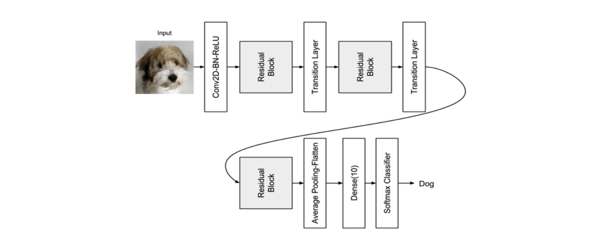

# ResNet

## 出现背景

深度学习中，随着神经网络模型层数的增加，梯度爆炸，梯度消失的情况经常存在。


## 解决方法

所以出现了ResNet模块。ResNet的想法是，为了防止梯度降级，我们将让信息通过快捷连接（shortcut connection ,也叫做skip connection）流向浅层。


## 原因解释

拿VGG和ResNet做对比，VGG的下一层特征取决于上一层特征图，也就是说神经网络层layer直接收之前特征图的影响，但是在ResNet中，通过残差映射，使得shortcut connection和输出之间的张量相加。就避免了梯度消失或爆炸的问题。


## ResNetv1 代码

<u>导入tensorflow库</u>

```python
from tensorflow.keras.layers import Dense, Conv2D
from tensorflow.keras.layers import BatchNormalization, Activation
from tensorflow.keras.layers import AveragePooling2D, Input
from tensorflow.keras.layers import Flatten, add
from tensorflow.keras.optimizers import Adam
from tensorflow.keras.callbacks import ModelCheckpoint, LearningRateScheduler
from tensorflow.keras.callbacks import ReduceLROnPlateau
from tensorflow.keras.preprocessing.image import ImageDataGenerator
from tensorflow.keras.regularizers import l2
from tensorflow.keras.models import Model
from tensorflow.keras.datasets import cifar10
from tensorflow.keras.utils import plot_model
from tensorflow.keras.utils import to_categorical
import numpy as np
import os
import math
```

<u>构建resnet_layer函数</u>

res_block模块基本组成```Conv2D-BN-ReLU```

最后一层res_block组成```Conv2D-BN ```->```ReLU```

```python
def resnet_layer(inputs,num_filters=16,kernel_size=3,strides=1,activation='relu',batch_normalization=True,conv_first=True):
  '''
  @param
    inputs:来自输入图像或前一层的输入张量
    num_filters:Conv2D过滤器数量
    kernel_size:COnv2D内核尺寸
    strides:Conv2D步长
    activation:激活函数
    batch_normalization:是否包括批处理规范化
    conv_first:检测是conv-bn-activation还是bn-activatin-conv
  @return
    x:张量作为下一层的输入
  '''
  #ResNet使用kernel_initializer='he_normal'来帮助反向传播时的收敛
  conv = Conv2D(num_filters,kernel_size=kernel_size,strides=strides,padding='same',kernel_initializer='he_normal',kernel_regularizer = l2(1e-4))
  x = inputs
  if conv_first:
    # 输入层和隐藏层内容
    x = conv(x)
    if batch_normalization:
      x = BatchNormalization()(x)
    if activation is not None:
      x = Activation(activation)(x)
  else:
    # 最后一层的构建
    if batch_normalization:
      x= BatchNormalization()(x)
    if activation is not None:
      x = Activation(activation)(x)
    x = conv(x) 
  return x 

```


<u>配置训练，模型的参数</u>

```python
n = 3 
# 模型版本-ResNet1
version = 1 

# 计算深度从模型的参数n中
if version ==1:
  depth = n*6 +2 
elif version==2:
  depth = n*9+2


# 模型名字，深度和版本
model_type = 'ResNet%dv%d'%(depth,version)

# 训练参数
batch_size = 32 
epochs = 200  
data_augmentation=True 
num_classes =10 

# 像素平均值减法提高精度
subtract_pixel_mean = True 
```


<u>加载数据，处理数据</u>

```python
# 加载数据集
(x_train,y_train),(x_test,y_test) = cifar10.load_data()
# 输入图片的维度
input_shape = x_train.shape[1:]
# 正则化
x_train = x_train.astype("float32")/255
x_test = x_test.astype('float32')/255 

# 如果启用了像素平均值减法
if subtract_pixel_mean:
    x_train_mean = np.mean(x_train,axis=0)
    x_train -= x_train_mean
    x_test -= x_train_mean

print('x_train shape:', x_train.shape)
print(x_train.shape[0], 'train samples')
print(x_test.shape[0], 'test samples')
print('y_train shape:', y_train.shape)
# #将类向量转换为二进制类矩阵。
y_train = to_categorical(y_train,num_classes)
y_test = to_categorical(y_test,num_classes)

# 选择使用哪一个模型
if version == 2:
  model = resnet_v2(input_shape=input_shape,depth=depth)
elif version==1:
  model = resnet_v1(input_shape=input_shape,depth=depth)

```


<u>构建ResNet1 模型</u>

模型结构



```python
def resnet_v1(input_shape,depth,num_classess=10):
    """
        @param
            input_shape (tensor): shape of input image tensor输入图像张量的形状
            depth (int): number of core convolutional layers核心卷积层的数量
            num_classes (int): number of classes (CIFAR10 has 10)类的数量（CIFAR10有10个）
        @return 
            model (Model): Keras model instance Keras模型实例
    """

    if (depth-2)%6!=0:
        raise ValueError("深度应该是6n+2(比如20,32 )")
    # 模型定义
    num_filters = 16 
    num_res_blocks = int((depth-2)/6)
		
    inputs = Input(shape=input_shape) 
    x = resnet_layer(inputs=inputs)
    # #实例化剩余单元堆栈
    for stack in range(3):
        for res_block in range(num_res_blocks):
            strides = 1 
            # 第一层但不是第一个堆
            if stack > 0 and res_block ==0:
                strides = 2 #下采样
            y = resnet_layer(inputs = x,num_filters=num_filters,strides=strides)

            y = resnet_layer(inputs=y,num_filters=num_filters,activation=None)
            # 第一层但不是第一个堆
            
            if stack > 0 and res_block==0:
                # 线性残差shortcut
                # 连接去匹配改变的dims
                x = resnet_layer(inputs=x,num_filters = num_filters,kernel_size=1,strides=strides,activation=None,batch_normalization=False)
						# skip connection,
            x = add([x,y])
            x = Activation('relu')(x)
        num_filters *=2 

    # 添加分类在顶部
    # v1 在最后的shortcut 连接relu，不使用BN，
    x = AveragePooling2D(pool_size=8)(x)
    y = Flatten()(x)
    outputs = Dense(num_classess,activation='softmax',kernel_initializer='he_normal')(y)
    #初始化模型
    model = Model(inputs=inputs,outputs=outputs)
    return model 
```


<u>定义一个在不同epoch的学习率</u>

```python
def lr_schedule(epoch):
    '''学习率规划
    @param
        epoch :epoch的数量
    @retun
        lr:学习率
    '''
    lr = 1e-3 
    if epoch >180:
        lr *= 0.5e-3 
    elif epoch > 160:
        lr *= 1e-3 
    elif epoch > 120:
        lr *= 1e-2 
    elif epoch > 80:
        lr *= 1e-1 
    print("leanring rate:",lr)
    return lr 
```


<u>训练模型</u>

- 图像数据增强api:[tf.keras.preprocessing.image.ImageDataGenerator()](https://www.tensorflow.org/api_docs/python/tf/keras/preprocessing/image/ImageDataGenerator)

  https://keras.io/zh/preprocessing/image/

  

  ```python
  tf.keras.preprocessing.image.ImageDataGenerator(
      featurewise_center=False,
      samplewise_center=False,
      featurewise_std_normalization=False,
      samplewise_std_normalization=False,
      zca_whitening=False,
      zca_epsilon=1e-06,
      rotation_range=0,
      width_shift_range=0.0,
      height_shift_range=0.0,
      brightness_range=None,
      shear_range=0.0,
      zoom_range=0.0,
      channel_shift_range=0.0,
      fill_mode='nearest',
      cval=0.0,
      horizontal_flip=False,
      vertical_flip=False,
      rescale=None,
      preprocessing_function=None,
      data_format=None,
      validation_split=0.0,
      interpolation_order=1,
      dtype=None
  )
  
  
  
  ```

  参数解释

  - **featurewise_center**: 布尔值。将输入数据的均值设置为 0，逐特征进行。

  - **samplewise_center**: 布尔值。将每个样本的均值设置为 0。

  - **featurewise_std_normalization**: Boolean. 布尔值。将输入除以数据标准差，逐特征进行。

  - **samplewise_std_normalization**: 布尔值。将每个输入除以其标准差。

  - **zca_epsilon**: ZCA 白化的 epsilon 值，默认为 1e-6。

  - **zca_whitening**: 布尔值。是否应用 ZCA 白化。

  - **rotation_range**: 整数。随机旋转的度数范围。

  - **width_shift_range**: 浮点数、一维数组或整数

  - **height_shift_range**: 浮点数、一维数组或整数

  - **shear_range**: 浮点数。剪切强度（以弧度逆时针方向剪切角度）。

  - **zoom_range**: 浮点数 或 `[lower, upper]`。随机缩放范围。如果是浮点数，`[lower, upper] = [1-zoom_range, 1+zoom_range]`。

  - **channel_shift_range**: 浮点数。随机通道转换的范围。

  - fill_mode

    : {"constant", "nearest", "reflect" or "wrap"} 之一。默认为 'nearest'。输入边界以外的点根据给定的模式填充：

    - 'constant': kkkkkkkk|abcd|kkkkkkkk (cval=k)
    - 'nearest': aaaaaaaa|abcd|dddddddd
    - 'reflect': abcddcba|abcd|dcbaabcd
    - 'wrap': abcdabcd|abcd|abcdabcd

  - **cval**: 浮点数或整数。用于边界之外的点的值，当 `fill_mode = "constant"` 时

  - **horizontal_flip**: 布尔值。随机水平翻转。

  - **vertical_flip**: 布尔值。随机垂直翻转。

  - **rescale**: 重缩放因子。默认为 None。如果是 None 或 0，不进行缩放，否则将数据乘以所提供的值（在应用任何其他转换之前）。

  - **preprocessing_function**: 应用于每个输入的函数。这个函数会在任何其他改变之前运行。这个函数需要一个参数：一张图像（秩为 3 的 Numpy 张量），并且应该输出一个同尺寸的 Numpy 张量。

  - **data_format**: 图像数据格式，{"channels_first", "channels_last"} 之一。"channels_last" 模式表示图像输入尺寸应该为 `(samples, height, width, channels)`，"channels_first" 模式表示输入尺寸应该为 `(samples, channels, height, width)`。默认为 在 Keras 配置文件 `~/.keras/keras.json` 中的 `image_data_format` 值。如果你从未设置它，那它就是 "channels_last"。

  - **validation_split**: 浮点数。Float. 保留用于验证的图像的比例（严格在0和1之间）。

  - **dtype**: 生成数组使用的数据类型。

- 回调函数[ModelCheckpoint()](https://keras.io/api/callbacks/model_checkpoint/)

  回调函数与训练结合使用model.fit()以在某个时间间隔保存模型或权重，因此可以在稍微加载模型或权重以从保存的状态继续训练。

  ```
  tf.keras.callbacks.ModelCheckpoint(
  		filepath,
      monitor: str = "val_loss",
      verbose: int = 0,
      save_best_only: bool = False,
      save_weights_only: bool = False,
      mode: str = "auto",
      save_freq="epoch",
      options=None,
      initial_value_threshold=None,
      **kwargs
  )
  ```

  参数解释

  - filepath:保存模型文件的路径

  - monitor:要监控的指标名称

  - verbose:详细模式，0或1。模式0是静默的，模式1在回调执行操作时显示消息

  - save_best_only:只保存被认为是最佳的模型参数

  - save_weights_only:

  - mode:

  - save_freq:

  - options:

  - initial_value_threshold:

    


```python
# 模型编译
model.compile(loss='categorical_crossentropy',
              optimizer=Adam(lr=lr_schedule(0)),
              metrics=['acc'])
# 绘制模型结构
model.summary()
plot_model(model, to_file=f"{model_type}.png" , show_shapes=True)
print(model_type)

# 为模型保存和学习率调整准备回调。
checkpoints = ModelCheckpoint(filepath=filepath,monitor='val_acc',verbose=1,save_best_only=True)

lr_scheduler = LearningRateScheduler(lr_schedule)
lr_reducer = ReduceLROnPlateau(factor=np.sqrt(0.1),cooldown=0,patience=5,min_lr=0.5e-6)
callbacks = [checkpoints,lr_reducer,lr_scheduler]

# 跑模型使用与否数据增强
if not data_augmentation:
    print("不使用数据增强")
    model.fit(x_train,
    y_train,
    batch_size=batch_size,
    epochs=epochs,
    validation_data=(x_test,y_test),
    shuffle=True,
    callbacks=callbacks)
else:
    print("使用数据增强")
    # 这个api要了解一下
    datagen = ImageDataGenerator(
        featurewise_center = False,
        samplewise_center = False ,
        featurewise_std_normalization=False ,

        samplewise_std_normalization= False ,
        zca_whitening=False ,
        
        rotation_range = 0,
        width_shift_range = 0.1,
        height_shift_range = 0.1,
        horizontal_flip=True,
        vertical_flip = False 
    )
    datagen.fit(x_train)

    steps_per_epoch = math.ceil(len(x_train)/batch_size)
    # fit the model on the batches generated by datagen.flow().
    model.fit(x=datagen.flow(x_train, y_train, batch_size=batch_size),
              verbose=1,
              epochs=epochs,
              validation_data=(x_test, y_test),
              steps_per_epoch=steps_per_epoch,
              callbacks=callbacks)

# 评估模型
scores = model.evaluate(x_test,y_test,batch_size=batch_size,verbose=0)
print('Test loss:', scores[0])
print('Test accuracy:', scores[1])
```

## ResNetv2 代码

只需要构建resnet_v2()函数

与ResNet1相比，ResNet2变换有

- 使用1x1-3x3-1x1的```BN-ReLU-Conv2D```残差块
- 正则化和激活函数在卷积操作之前


```python
def resnet_v2(input_shape,depth,num_classess=10):
    '''
    @param
        input_shape:输入图片的张量
        depth:conv层数
        num_classess:类别数量
    @return
        model:keras模型
    '''
    if (depth -2 )%9!=0:
        raise ValueError("深度应该是9n+2(比如110)")
    num_filters_in = 16 
    num_res_blocks = int((depth-2)/9)
    inputs = Input(shape=input_shape)

    x = resnet_layer(inputs=inputs,num_filters=num_filters_in,conv_first=True)

    # 实例化剩余单元堆栈
    for stage in range(3):
        for res_block in range(num_res_blocks):
            activation ='relu'
            batch_normalization=True 
            strides = 1 
            if stage ==0:
                num_filters_out = num_filters_in*4
                if res_block==0:
                    activation = None 
                    batch_normalization =False 
            else:
                num_filters_out = num_filters_in*2 
                if res_block:
                    strides =2 
            # 瓶颈剩余单元
            y = resnet_layer(
                inputs = x,
                num_filters=num_filters_in,
                kernel_size=1,
                strides=strides,
                activation=activation,
                batch_normalization=batch_normalization,
                conv_first=False )
            
            y = resnet_layer(inputs=y,num_filters=num_filters_in,conv_first=False)

            y = resnet_layer(inputs=y,num_filters=num_filters_in,conv_first=False)

            if res_block==0:
                # 线性投影剩余捷径连接
                #以匹配更改的尺寸
                x = resnet_layer(
                    inputs=x,
                    num_filters=num_filters_out,
                    kernel_size=1,
                    strides=strides,
                    activation=None,
                    batch_normalization=False)
            x = add([x,y])
        num_filters_in = num_filters_out
    # 在顶部添加分类器。
    #v2在池化之前具有BN ReLU
    x = BatchNormalization()(x)
    x = Activation('relu')(x)
    x = AveragePooling2D(pool_size=8)(x)
    y = Flatten()(x)
    outputs = Dense(num_classess,activation='softmax',kernel_initializer='he_normal')(y)

    # 初始化模型
    model = Model(inputs=inputs,outputs=outputs)
    return model 

```

